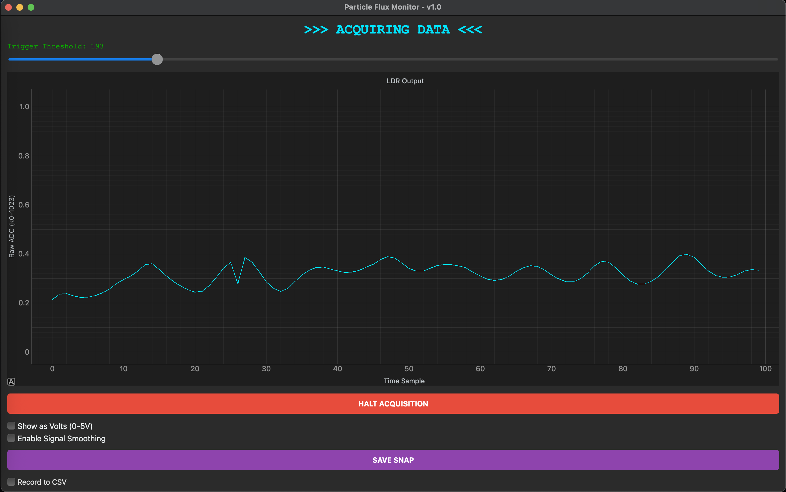

# IoT Sensor Dashboard & Control System


## Overview
This project is a full-stack IoT application that interfaces with an Arduino microcontroller to perform real-time data acquisition, signal processing, and hardware control. It features a bi-directional communication protocol where Python visualizes sensor data and sends control commands back to the hardware based on user-defined thresholds.



## Features
* **Real-Time Data Acquisition:** Reads 10-bit analog sensor data via Serial (UART) at 9600 baud.
* **Bi-Directional Control Loop:**
    * **Input:** Live plotting of sensor values using `pyqtgraph`.
    * **Output:** Sends control signals ('H'/'L') to Arduino to trigger hardware actuators (LEDs) based on software thresholds.
* **Digital Signal Processing (DSP):**
    * **Smoothing:** Implements a Moving Average Filter (Queue-based) to reduce sensor noise.
    * **Calibration:** Dynamic unit conversion (Raw ADC 0-1023 to Voltage 0-5V).
* **Data Logging:** Automatically logs time-stamped data to CSV for post-analysis.
* **Reporting:** Instant graph snapshot export (.png) for data visualization.

## Hardware Requirements
* Arduino Uno/Nano (or compatible board)
* Analog Sensor (LDR, Potentiometer, or Thermistor)
* Output Actuator (LED + 220Ω Resistor)
* USB Cable

## Software Prerequisites
* **Python 3.8+**
* Required Libraries:
    ```bash
    pip install PyQt6 pyqtgraph pyserial
    ```

## Installation & Usage

1.  **Flash Firmware:**
    * Open `arduino_firmware.ino` in the Arduino IDE.
    * Upload to your board.

2.  **Run Dashboard:**
    * Verify your COM port in `main.py` (e.g., `/dev/cu.usbmodem...` or `COM3`).
    * Run the application:
        ```bash
        python main.py
        ```

3.  **Controls:**
    * **Initialize Acquisition:** Opens the serial port and starts plotting.
    * **Threshold Slider:** Sets the trigger point. If the sensor value drops below this line, the Arduino LED turns ON.
    * **Smoothing:** Toggles the Moving Average Filter.
    * **Volts Mode:** Calibrates the display to voltage (0-5V).

## Project Structure
* `main.py`: Main application entry point.
* `worker.py` : Serial Thread Module.
* `dashboard.py` : GUI, and LOGIC module
* `arduino_firmware.ino`: C++ code for the microcontroller.

